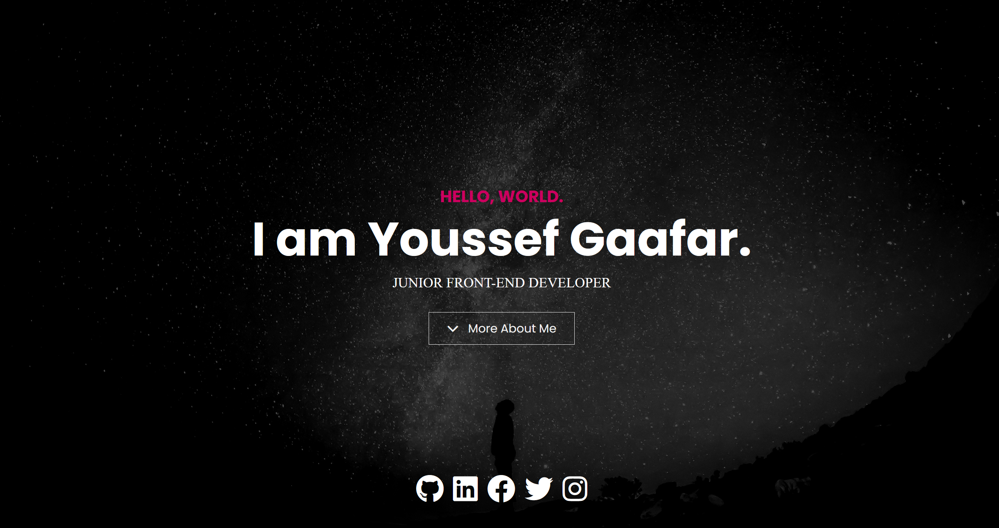

# 💼 Portfolio Website 💼

Welcome to my Portfolio! This is a dark-light contrast website for showcasing my work as a web developer. It can be customized for any type of portfolio. The site includes custom JavaScript for a typewriter effect and uses the "Lightbox" script for project modals.

## 📸 Dashboard



## ✨ Features

- 🌗 Dark and light contrast
- 📱 Responsive design
- 🖼️ Full height header/hero
- 🌄 Background image overlays
- ⌨️ Typewriter effect in header
- 💡 Lightbox modals for projects
- 📊 Progress bar stats
- 🔥 Font awesome icons
- 💼 Directly download my CV/Resume

## 🚀 Usage

This website is built with [Bootstrap](https://getbootstrap.com/) and [Sass](https://sass-lang.com/). It uses [Font Awesome](https://fontawesome.com/) for icons.

### Prerequisites

To customize this website, you need to install [Node.js](https://nodejs.org/en/).

### Installation

Clone this repository and run:

```bash
npm install
```

This will install Bootstrap, Sass, and Font Awesome.

### Building CSS

To build your CSS files from Sass, run:

```bash
npm run sass:build
```

### Watching Sass Files

To watch your Sass files for changes, run:

```bash
npm run sass:watch
```

### Customization

You can add Bootstrap variables to the `bootstrap.scss` file. Refer to `node_modules/bootstrap/dist/scss/_variables.scss` for a list of all the variables. **Do NOT edit the `variables.scss` file directly**, as it will be overwritten when you update Bootstrap.

To add your own custom styles, use the `styles.scss` file.

## 📬 Contact

Feel free to reach out if you have any questions or suggestions!

- Email: [yousfjaafer@gmail.com](mailto:yousfjaafer@gmail.com)
- LinkedIn: [Youssef Gaafar](https://www.linkedin.com/in/youssefgaafar/)
- X (Formely Twitter): [@JoGaafar](https://x.com/JoGaafar)

Thank you for visiting my portfolio! 😊
